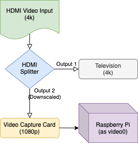

# Harmonize Project for Philips Hue

Harmonize turns HDMI video into low-latency ambient lighting for Philips Hue
lights and lightstrips. A capture device supplies frames to a Raspberry Pi;
Harmonize analyzes colors near each configured light's screen position and
streams them through the Hue Entertainment API.

The modernized version runs as a boot-started appliance. It starts safely in
IDLE, waits for an explicit ON command, streams while enabled, and returns to
IDLE with the configured Entertainment-area lights off after an explicit OFF
or service stop.

> Harmonize Project (formerly Harmonize Hue) is not affiliated with Signify or
> Philips Hue. Hue and Philips Hue are trademarks of Signify.

## See it in action

The original project resources remain useful introductions:

- [Harmonize release discussion on Reddit](https://www.reddit.com/r/Hue/comments/i1ngqt/release_harmonize_project_sync_hue_lights_with/)
- [Electromaker podcast explanation](https://youtu.be/tYnvYYWedVc?t=1790)
- [Original Harmonize demonstration](http://www.youtube.com/watch?v=OkyUntgiYzQ)

## Architecture and behavior

~~~text
HDMI source / camera
        |
        v
HDMI splitter or second AVR output ---> television
        |
        v
USB capture device ---> Raspberry Pi ---> Harmonize ---> Hue Bridge
                                                        (Entertainment API)
                                                               |
                                                               v
                                                    Entertainment-area lights
~~~

The capture stream provides color data; it is not used as a TV-power sensor.
Many sources and splitters continue producing valid video while the television
is off. The current product therefore uses explicit ON/OFF control through a
private local Unix socket or the trusted-LAN HTTP adapter.

Current capabilities include:

- Per-light color and intensity derived from each light's relative screen
  position, including Hue gradient lightstrips.
- A separated and tested capture/Hue/analysis/transport/controller runtime.
- Deterministic, noninteractive selection of one named Hue Entertainment area.
- Bounded startup, shutdown, capture recovery, DTLS recovery, and cleanup.
- Light-state journaling for exceptional recovery; explicit OFF always powers
  the configured area lights off.
- A persistent desired-state supervisor with IDLE, startup, STREAMING,
  recovery, and error states.
- Hardened systemd services for unattended boot, local control, health/status,
  journald logging, and trusted-LAN HTTP control on TCP 8765.

The upstream project documented about 80 ms video-to-light latency and roughly
60 color updates per second. Actual results depend on the Pi, capture device,
resolution, frame rate, network, and number/type of lights.

## Project history and attribution

This repository is a fork and continuation, not a from-scratch project.
Harmonize originated in the open-source
[MCPCapital/HarmonizeProject](https://github.com/MCPCapital/HarmonizeProject)
repository in 2020 and was originally known as Harmonize Hue. Repository
history identifies Matthew C. Pilsbury / MCP Capital LLC as the original author
and principal early maintainer. Brad Dworak later maintained and extended the
project through the upstream v2.4.2 baseline. The upstream README gives
development credit to **Matthew C. Pilsbury (MCP Capital LLC), Ares N. Vlahos,
and Brad Dworak**; those credits are preserved here. Git history also records
contributions from Mychal Thompson, Robin Hubbig, Apoorv Bhawsar, and other
community contributors.

This [quexionjb continuation](https://github.com/quexionjb/HarmonizeProject)
was created to keep Harmonize useful on a current Raspberry Pi/Python stack and
to turn the earlier interactive script into a reliable appliance. The work was
motivated by difficult-to-reproduce dependencies, script-level configuration,
race-prone capture and shutdown behavior, ambiguous unattended bridge/area
selection, and the need for explicit automation when capture activity cannot
reliably indicate television power.

The modernized implementation retains the original Harmonize concept, color
mapping, Hue Entertainment approach, historical hardware knowledge, media, and
community credits while adding typed non-secret configuration, protected
credentials, separated runtime components, deterministic area resolution,
recovery and light-state handling, a desired-state supervisor, hardened
systemd deployment, and local/HTTP control. The original concept and earlier
implementation remain credited to the people who developed Harmonize before
this fork.

## Requirements

### Hue

- A Philips Hue Bridge that supports the Entertainment API. The upstream
  minimum documented firmware was 194808600 or newer; use the Hue app to keep
  the bridge current.
- At least one Entertainment-compatible Hue light or lightstrip.
- A configured Entertainment area containing no more than 20 streaming
  channels. A gradient lightstrip historically counts as seven.
- The documented appliance configuration expects an area named exactly
  **TV area** (case-sensitive). Creating that name is the simplest path.
  Advanced users may change hue.entertainment_area before deployment.

### Raspberry Pi and software

The accepted environment is:

- Raspberry Pi 5 running 64-bit Ubuntu 24.04 and Python 3.12.3.
- OpenCV 4.10.0 built for Python 3.12 with GStreamer, FFmpeg, and V4L2 enabled.
- GStreamer 1.24.x from Ubuntu and OpenSSL 3.x for the DTLS transport.

Upstream also documented Raspberry Pi 4B, 3B, Zero, or another four-core Linux
host at about 1.5 GHz or faster. Pi 5/4 hardware is recommended for 1080p. Older
Pis generally require lower resolutions and frame rates (the historical Zero
example used about 10 FPS). Allow at least 256 MiB free RAM; 512 MiB free is a
better target. Those older combinations are useful historical guidance but
were not revalidated for the appliance release.

Use the recommended power supply for the selected Pi and a reliable wired LAN
where possible. Reserve the Pi's address in DHCP (a static lease) so controllers
such as Homebridge can keep reaching it.

### Video path and capture hardware

For an HDMI source you normally need:

- An HDMI splitter capable of sending the display's preferred format to the TV
  while independently downscaling the capture output to 1080p or 720p, or an
  A/V receiver with a usable second HDMI output.
- A low-latency USB capture device. The upstream target was 50 ms or less and
  720p/1080p capture.
- Appropriate HDMI cables and, preferably, a USB 3 capture device connected to
  a USB 3 port.

Historically tested examples include the
[AVSTAR 4K HDMI 2.0 1x2 splitter](https://www.amazon.com/dp/B08D9BCX1R),
[WIIStar USB 3 capture card](https://www.amazon.com/gp/product/B07Z7RNDBZ/),
and Elgato Cam Link 4K. The accepted appliance was validated with a MacroSilicon
WARRKY USB 3 capture device. The upstream README also listed a
[Panoraxy capture device](https://www.amazon.com/Panoraxy-Capture-1080PFHD-Broadcast-Camcorder/dp/B088PYDJ22/)
and generic capture dongles as untested examples. A camera or supported
file/URL stream remains possible, but the packaged appliance unit is presently
configured for the validated USB device. The upstream guide cited
[RPi Cam Web Interface](https://github.com/silvanmelchior/RPi_Cam_Web_Interface)
as one historical camera-input option.

## Connect the hardware

### Splitter topology

1. Connect the source (streaming box, console, etc.) to the splitter input.
2. Connect the splitter's full-resolution output to the TV.
3. Connect its second/downscaled output to the HDMI capture device.
4. Connect the capture device to a USB 3 port on the Pi.
5. Configure the splitter to downscale only the capture branch to 1080p or
   720p. Confirm that HDCP, HDR, EDID, and audio choices are compatible with
   your source/display/capture chain.

### Receiver topology

1. Connect sources to the receiver as usual and receiver HDMI output 1 to the
   TV.
2. Connect receiver HDMI output 2 to a splitter if downscaling is needed, then
   connect the downscaled output to the capture device.
3. Connect the capture device to a USB 3 port on the Pi.

Turning off a TV does not necessarily stop the independent capture branch.
That is normal; use Harmonize's explicit ON/OFF controls rather than treating
frame delivery as a power signal.

## Fresh installation

These instructions reproduce the accepted native Ubuntu/Python installation.
They do not require Docker.

### 1. Install Ubuntu and system packages

Use Raspberry Pi Imager on another computer to write **Ubuntu Desktop 24.04
LTS 64-bit** to a good 32 GB or larger card. The Desktop image is the upstream
and accepted tested choice; a headless Server image may work but has not been
recorded as equivalent. In Imager, configure the user as pi, networking, SSH,
and a strong password, then boot and update the system.

~~~console
sudo apt update
sudo apt upgrade
sudo apt install git curl wget unzip rsync v4l-utils build-essential cmake \
  pkg-config python3.12 python3.12-dev python3.12-venv python3-numpy \
  libavcodec-dev libavformat-dev libswscale-dev \
  libgstreamer1.0-dev libgstreamer-plugins-base1.0-dev \
  gstreamer1.0-tools gstreamer1.0-plugins-base gstreamer1.0-plugins-good \
  libgtk-3-dev openssl
~~~

The old setup.sh is retained as upstream history, but it targets obsolete
packages and is not the supported modern appliance installer.

### 2. Verify the capture device

Connect and power the complete HDMI chain, then inspect the available nodes:

~~~console
ls -l /dev/video* /dev/v4l/by-id/* 2>/dev/null
v4l2-ctl --list-devices
v4l2-ctl --device=/dev/video0 --all
v4l2-ctl --device=/dev/video0 --list-formats-ext
~~~

The primary video node is commonly /dev/video0; many dongles also expose a
companion metadata or secondary node. Prefer the stable
/dev/v4l/by-id/...-video-index0 path for appliance use so enumeration changes
after reboot do not select the wrong device.

After the Python/OpenCV setup below, perform a non-recording headless probe:

~~~console
timeout 25s /home/pi/harmonize_env/bin/python tools/capture_probe.py \
  --label fresh-install --duration 15 --device-index 0 --backend gstreamer
~~~

Look for an opened value of true, successful frames, the expected resolution,
and few or no failed reads. On a desktop you can also run
/home/pi/harmonize_env/bin/python videotest.py and press Esc to close the
preview. The probe saves no frames.

### 3. Clone this continuation

Install from master:

~~~console
cd /home/pi
git clone --branch master https://github.com/quexionjb/HarmonizeProject.git
cd /home/pi/HarmonizeProject
~~~

### 4. Create the Python 3.12 environment

The deployment script currently copies the accepted environment from the exact
path /home/pi/harmonize_env, so use that path:

~~~console
python3.12 -m venv /home/pi/harmonize_env
/home/pi/harmonize_env/bin/python -m pip install --upgrade pip
/home/pi/harmonize_env/bin/python -m pip install -r requirements.lock
/home/pi/harmonize_env/bin/python -m pip check
~~~

requirements.lock reproduces the accepted Python package set. OpenCV is
intentionally excluded because generic opencv-python wheels are not a proven
replacement for the required GStreamer-enabled build.

### 5. Build OpenCV 4.10.0 with GStreamer

First check whether the installed OpenCV already meets the boundary:

~~~console
python3.12 -c 'import cv2; print(cv2.__version__)'
python3.12 -c 'import cv2; print("GStreamer: YES" in cv2.getBuildInformation())'
~~~

If OpenCV 4.10.0 is unavailable or the second command prints False, build it.
This can take hours on slower Pis:

~~~console
cd /home/pi
wget -O opencv-4.10.0.zip https://github.com/opencv/opencv/archive/4.10.0.zip
unzip opencv-4.10.0.zip
cmake -S opencv-4.10.0 -B opencv-build \
  -D CMAKE_BUILD_TYPE=Release \
  -D CMAKE_INSTALL_PREFIX=/usr/local \
  -D BUILD_opencv_java=OFF \
  -D BUILD_opencv_python2=OFF \
  -D BUILD_opencv_python3=ON \
  -D PYTHON_DEFAULT_EXECUTABLE=/usr/bin/python3.12 \
  -D INSTALL_C_EXAMPLES=OFF \
  -D INSTALL_PYTHON_EXAMPLES=OFF \
  -D BUILD_EXAMPLES=OFF \
  -D BUILD_TESTS=OFF \
  -D BUILD_PERF_TESTS=OFF \
  -D WITH_CUDA=OFF \
  -D WITH_FFMPEG=ON \
  -D WITH_GSTREAMER=ON \
  -D WITH_V4L=ON
cmake --build opencv-build --parallel 4
sudo cmake --install opencv-build
sudo ldconfig
~~~

The accepted build installed cv2 under
/usr/local/lib/python3.12/site-packages/cv2. Expose that system build to the
virtual environment (adjust only if the build reported a different path):

~~~console
ln -s /usr/local/lib/python3.12/site-packages/cv2 \
  /home/pi/harmonize_env/lib/python3.12/site-packages/cv2
/home/pi/harmonize_env/bin/python -c 'import cv2; print(cv2.__version__)'
/home/pi/harmonize_env/bin/python -c \
  'import cv2; print("GStreamer: YES" in cv2.getBuildInformation())'
~~~

Do not continue until those commands report OpenCV 4.10.0 and True.
Distribution upgrades may require rebuilding OpenCV and recreating the link.
The [OpenCV Linux build guide](https://docs.opencv.org/4.10.0/d7/d9f/tutorial_linux_install.html)
provides additional compiler/build details.

### 6. Create a Hue Entertainment area

In the Hue app, open **Settings -> Entertainment areas**, create an area, add
the lights around the display, and position them to match the room. The area
can have any name; the setup wizard lists all available areas for selection.

### 7. Run first-time setup

Make sure the Pi and Hue Bridge are on the same LAN, then run:

~~~console
cd /home/pi/HarmonizeProject
/home/pi/harmonize_env/bin/python setup_harmonize.py
~~~

The wizard discovers local bridges with mDNS, offers a choice when multiple
bridges are found, guides link-button pairing, lists the Entertainment areas,
and creates both private `client.json` credentials and `harmonize.toml` with
the selected area and stable bridge ID.

No manual bridge IP, group number, or credential-file creation is normally
required. If mDNS is unavailable, rerun with the bridge LAN IP as a fallback:

~~~console
/home/pi/harmonize_env/bin/python setup_harmonize.py -i 192.0.2.20
~~~

Keep `client.json` secret and never commit or share it. Rerunning the wizard
reuses existing credentials and asks before updating `harmonize.toml`. Setup
does not use cloud discovery, and normal startup never creates credentials.

### 8. Review and validate

Review the generated `harmonize.toml`, especially the capture settings. Use a
stable `/dev/v4l/by-id/...-video-index0` value for `capture.device_path` when
available, then validate the configuration and selected Hue area:

~~~console
/home/pi/harmonize_env/bin/python tools/validate_config.py \
  --config harmonize.toml --mode unattended --check-credentials
/home/pi/harmonize_env/bin/python harmonize.py \
  --config harmonize.toml --check-area
~~~

The first command is offline. The second contacts Hue but does not start
Entertainment streaming.

### 9. Test in the foreground

Start Harmonize in one terminal; a successful launch waits safely in IDLE:

~~~console
cd /home/pi/HarmonizeProject
/home/pi/harmonize_env/bin/python harmonize.py --config harmonize.toml
~~~

From a second terminal, start and stop synchronization:

~~~console
cd /home/pi/HarmonizeProject
/home/pi/harmonize_env/bin/python tools/harmonize_control.py \
  ON --config harmonize.toml
/home/pi/harmonize_env/bin/python tools/harmonize_control.py \
  OFF --config harmonize.toml
~~~

Verify that ON reaches STREAMING and the selected area's lights follow the
display. Verify that OFF returns to IDLE and powers those lights off, then stop
the foreground process with Ctrl-C. Continue below to install the boot-started
appliance services.

## Install the appliance services

### Review the deployment-specific paths

The accepted deployment is intentionally pinned to the tested Pi. Before
installation, compare your stable capture path with these three references:

- capture=... in deploy/install-systemd.sh
- capture.device_path in deploy/harmonize.toml
- both ConditionPathExists= and DeviceAllow= in deploy/harmonize.service

The repository defaults identify the validated MacroSilicon WARRKY device. If
your path differs, edit all three references to the same existing
/dev/v4l/by-id/...-video-index0 path. Also update hue.entertainment_area in
deploy/harmonize.toml if you did not use TV area. The installer expects
/home/pi/harmonize_env; a different account requires adjusting that source path
before installation.

### Install harmonize.service

From the tested repository checkout and environment:

~~~console
cd /home/pi/HarmonizeProject
sudo ./deploy/install-systemd.sh client.json
~~~

The guarded installer refuses to replace an existing Harmonize installation.
It creates a locked harmonize service account with only supplementary video
access, then installs:

- root-owned application and virtual environment under /opt/harmonize;
- non-secret config at /etc/harmonize/harmonize.toml;
- private credentials at /etc/harmonize/client.json;
- private runtime/socket/health data under /run/harmonize;
- private persistent recovery state under /var/lib/harmonize;
- the hardened unit at /etc/systemd/system/harmonize.service.

The unit is enabled and started immediately. At every normal reboot, systemd
waits for networking and the capture path, validates configuration and
credentials, resolves the area without prompting, and starts Harmonize in
IDLE. No login, terminal, screen session, or manual Python startup is required.
An unexpected process failure is restarted after five seconds, with start-rate
limiting; an intentional systemctl stop remains stopped until it is started
again or the machine reboots.

### Install harmonize-http.service

After the core service is installed, install the HTTP layer directly from the
same repository checkout:

~~~console
sudo ./deploy/install-http.sh
~~~

The guarded installer accepts the byte-identical HTTP files copied by the core
installer, so this command is safe to repeat from the same revision. It still
refuses to overwrite any differing file. The HTTP installer adds and enables
harmonize-http.service, listens on all IPv4 interfaces on TCP 8765, and uses the
existing owner-only Unix socket. It does not receive access to the Hue
credential or persistent light-state directory.

## Operate Harmonize

### Local ON/OFF/STATUS

The service socket is owner-only, so invoke the installed client as the locked
service identity:

~~~console
sudo -u harmonize /opt/harmonize/venv/bin/python \
  /opt/harmonize/app/tools/harmonize_control.py \
  STATUS --config=/etc/harmonize/harmonize.toml
sudo -u harmonize /opt/harmonize/venv/bin/python \
  /opt/harmonize/app/tools/harmonize_control.py \
  ON --config=/etc/harmonize/harmonize.toml
sudo -u harmonize /opt/harmonize/venv/bin/python \
  /opt/harmonize/app/tools/harmonize_control.py \
  OFF --config=/etc/harmonize/harmonize.toml
~~~

Local ON/OFF wait for STREAMING/IDLE by default and return a detailed JSON
status snapshot.

### Trusted-LAN HTTP control

The HTTP adapter accepts only these exact GET targets:

- <code>http://&lt;pi-ip&gt;:8765/?harmonize=on</code>
- <code>http://&lt;pi-ip&gt;:8765/?harmonize=off</code>
- <code>http://&lt;pi-ip&gt;:8765/?harmonize=status</code>

Example requests using a documentation-only address:

~~~console
curl --fail-with-body 'http://192.0.2.10:8765/?harmonize=status'
curl --fail-with-body 'http://192.0.2.10:8765/?harmonize=on'
curl --fail-with-body 'http://192.0.2.10:8765/?harmonize=off'
~~~

STATUS returns concise machine-readable state and the active non-secret
performance configuration:

~~~json
{"state":"STREAMING","performance":{"color_processing_mode":"direct_rgb","update_interval_seconds":0.033,"brightness_adjustment":0}}
~~~

ON/OFF return acceptance immediately; poll STATUS until it reports a state of
STREAMING or IDLE. Missing, duplicate, extra, or unsupported query input
returns HTTP 400; non-GET methods return 405; an unavailable core daemon
returns 503.

**This endpoint intentionally has no authentication and no TLS.** It is meant
only for a trusted home LAN. Do not port-forward TCP 8765, expose it to a guest
or public network, or publish it through an internet-facing reverse proxy. The
installer does not change the Pi firewall or router.

### Homebridge / HomeKit example

One practical integration is the maintained
[homebridge-http-switch](https://github.com/homebridge-plugins/homebridge-http-switch)
plugin. Install it through the Homebridge UI or according to that plugin's
instructions, then add an accessory like this to Homebridge's config.json.
Replace the documentation address with the Pi's reserved LAN address:

~~~json
{
  "accessory": "HTTP-SWITCH",
  "name": "Harmonize Ambilight",
  "switchType": "stateful",
  "onUrl": "http://192.0.2.10:8765/?harmonize=on",
  "offUrl": "http://192.0.2.10:8765/?harmonize=off",
  "statusUrl": "http://192.0.2.10:8765/?harmonize=status",
  "statusPattern": "\"state\":\"STREAMING\"",
  "pullInterval": 5000
}
~~~

Restart Homebridge and verify the switch first with Harmonize already in IDLE,
then ON, then OFF. A DHCP reservation/static lease prevents the URL from
changing. A hostname such as harmonize.local may work through mDNS, but .local
resolution is not available in every Homebridge container, network, or host
configuration; the reserved LAN IP is usually more reliable.

## Status, logs, and troubleshooting

Useful service checks:

~~~console
systemctl is-enabled harmonize.service harmonize-http.service
systemctl status harmonize.service harmonize-http.service
systemctl show harmonize.service -p ActiveState -p SubState -p NRestarts
systemctl show harmonize-http.service -p ActiveState -p SubState -p NRestarts
journalctl -u harmonize.service -b --no-pager
journalctl -u harmonize-http.service -b --no-pager
journalctl -u harmonize.service -f
curl --fail-with-body 'http://127.0.0.1:8765/?harmonize=status'
~~~

Common problems:

- **Unit skipped or core service will not start:** inspect
  ConditionPathExists, confirm /etc/harmonize/client.json, and confirm the
  configured stable capture path exists. Check the journal for the exact
  validation error.
- **Capture is absent:** run v4l2-ctl --list-devices, inspect /dev/video* and
  /dev/v4l/by-id, confirm the HDMI chain is powered, and ensure the capture
  device is on USB 3. Re-run tools/capture_probe.py.
- **Capture opens outside the service but not inside it:** ensure the service
  path matches both DeviceAllow and capture.device_path; confirm the harmonize
  account has its supplementary video group.
- **OpenCV import fails or capture will not use GStreamer:** activate the
  accepted venv, verify the cv2 link, then inspect cv2.getBuildInformation().
  Rebuild after a Python/Ubuntu upgrade.
- **Area resolution fails:** match capitalization exactly, remove duplicate
  Entertainment-area names, keep the bridge current, and optionally set the
  Hue bridge IP in TOML if discovery is unreliable.
- **ON is accepted but never reaches STREAMING:** check core logs for capture,
  area, Hue, or DTLS recovery errors. Verify the selected area is not already
  controlled by another Entertainment application.
- **HTTP is unreachable:** confirm harmonize-http.service is active and
  listening on port 8765, test loopback first, then check LAN/VLAN/firewall
  policy. Do not weaken network isolation beyond the trusted LAN.
- **HTTP STATUS says STARTING, RECOVERING, or ERROR:** treat STATUS as actual
  state, not merely the last requested position; inspect the core journal.
- **Pending light-state journal:** follow the
  [headless reliability documentation](docs/milestone-4-headless-reliability.md)
  and [light-state documentation](docs/milestone-6-light-state.md) before
  forcing another session.

For the expected end-to-end result, a healthy reboot leaves both services
active and STATUS at IDLE. ON transitions to STREAMING and the selected area
follows captured video. OFF transitions back to IDLE, stops Hue Entertainment,
and powers every light in the selected area off.

## Uninstall and rollback

Run rollback scripts from the **same repository revision used to install**;
they intentionally refuse unrecognized files. Remove the HTTP layer first:

~~~console
cd /home/pi/HarmonizeProject
sudo ./deploy/uninstall-http.sh
~~~

This disables/removes only harmonize-http.service, its installed adapter, and
its installed documentation. It leaves the core service, account,
configuration, credentials, and state intact.

To remove the complete appliance afterward:

~~~console
sudo ./deploy/uninstall-systemd.sh
~~~

The guarded core rollback disables/stops harmonize.service, removes the
recognized unit and /opt/harmonize, /etc/harmonize, /var/lib/harmonize, and
/run/harmonize, then removes the locked service account. This deletes the
**installed** credential copy under /etc/harmonize; the ignored repository
client.json used for installation is left untouched. Preserve a secure backup
before uninstalling if that repository copy will not remain available.

To reinstall, recheck the capture/configuration paths and rerun the core and
HTTP installation sections. Do not manually delete deployment paths to recover
from an installer refusal until you understand why its ownership guard fired.

## Detailed documentation

- [Configuration and dependency boundary](docs/milestone-2-configuration.md)
- [Runtime refactor and area validation](docs/milestone-3-refactor.md)
- [Headless reliability and recovery](docs/milestone-4-headless-reliability.md)
- [Desired-state supervisor and local control](docs/milestone-5-state-machine.md)
- [Light-state handling](docs/milestone-6-light-state.md)
- [systemd appliance deployment](docs/milestone-7-systemd.md)
- [Trusted-LAN HTTP control](docs/milestone-8-http.md)

These documents retain design rationale and validation details. This README is
the product install/operations guide; understanding the development milestones
is not required to operate Harmonize.

## Contributions and license

Pull requests and documentation improvements are welcome. Preserve the
historical attribution above when redistributing or modifying this work.

The v2.4.2 upstream README, the baseline for this continuation, declares
Harmonize Project licensed under the
[Creative Commons Attribution-NonCommercial 4.0 International Public License](https://creativecommons.org/licenses/by-nc/4.0/legalcode).
Earlier repository history also contains a removed license file naming CC
BY-NC 3.0 Unported. This fork preserves the current upstream 4.0 declaration
and does not claim to relicense earlier contributions; consult the repository
history if the distinction affects your use, and contact the relevant rights
holders for commercial permission.

Development credits preserved from upstream: **Matthew C. Pilsbury (MCP
Capital LLC), Ares N. Vlahos, and Brad Dworak.** Thanks also to every historical
and current contributor who has improved Harmonize.

